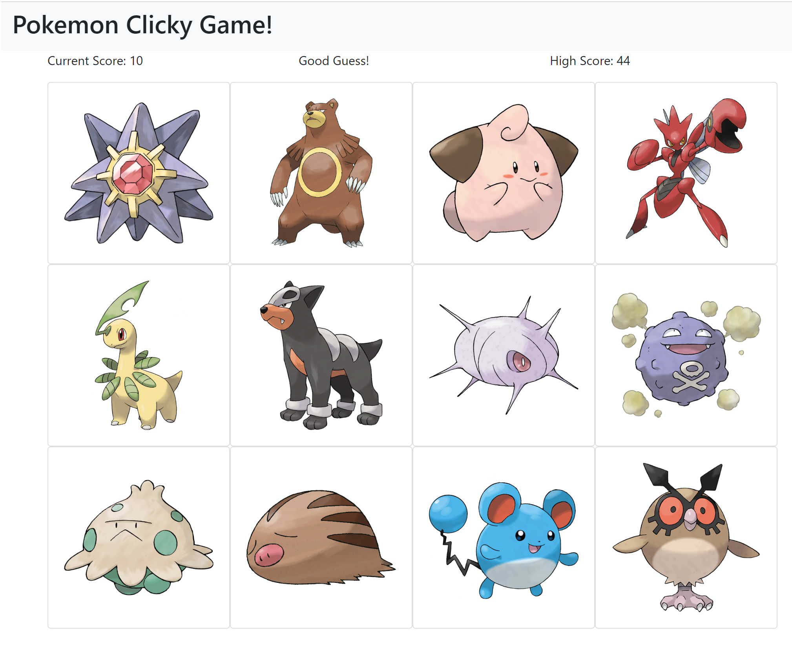

Try it here: https://pokemon-clicky-game1.herokuapp.com/

Please note that the first time load might take a while. The game features many high resolution images!

# Pokemon Clicky Game
A dynamic web based game to test your memory. Written using React.js.

### How to Play:
- Each time you click on a picture of a pokemon, a point will be added to your score.
- However, a unique Pokemon must be selected each time. If any Pokemon is clicked more than once in a single round, the score is reset and the round is lost.
- There are 300 different Pokemon in this game! Do you think you can catch 'em all?

### Packages & Libraries
- [Express.js](https://expressjs.com/)
- [Node.js](https://nodejs.org/en/)
- [Heroku](https://www.heroku.com/)
- [ReactJS](https://reactjs.org/)

### Screenshots

### Notes
This is an ongoing project. Comments and feedbacks are appreciated!

### Credits
All images and characters used in this application are owned by Nintendo. We do not claim ownership to any of the characters. This program was made as a project and is not to be sold.
